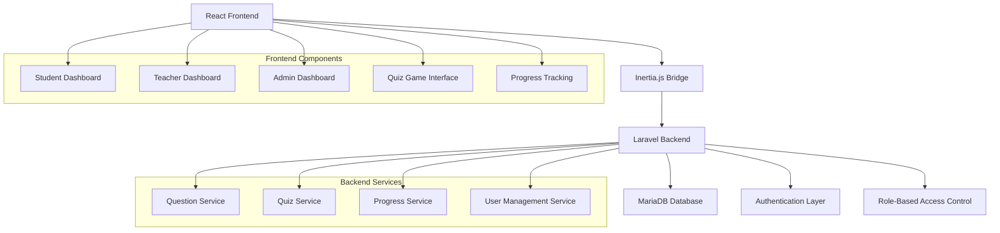

# Design Document

## Overview

Math Racers: Solve to Win is a gamified educational web application built on Laravel backend with React frontend using Inertia.js. The system leverages the existing Laravel Breeze authentication foundation and extends it with role-based access control for Students, Teachers, and Admins. The core gameplay revolves around a racing metaphor where students advance their racer characters by answering math questions correctly.

## Architecture

### High-Level Architecture



### Technology Stack

-   **Frontend**: React 18 with Inertia.js for SPA-like experience
-   **Styling**: Tailwind CSS with custom kid-friendly themes
-   **Backend**: Laravel 12 with existing Breeze authentication
-   **Database**: MariaDB (XAMPP setup)
-   **Testing**: Pest PHP for backend, React Testing Library for frontend
-   **State Management**: Inertia.js shared data and React hooks

## Components and Interfaces

### Database Schema

#### Users Table (Extended from Breeze)

```sql
users (
    id: bigint primary key,
    name: varchar(255),
    email: varchar(255) unique,
    email_verified_at: timestamp nullable,
    password: varchar(255),
    role: enum('student', 'teacher', 'admin'),
    grade_level: tinyint nullable, -- for students only
    created_at: timestamp,
    updated_at: timestamp
)
```

#### Questions Table

```sql
questions (
    id: bigint primary key,
    question_text: text,
    question_type: enum('addition', 'subtraction', 'multiplication', 'division'),
    grade_level: tinyint,
    difficulty: enum('easy', 'medium', 'hard'),
    correct_answer: varchar(255),
    options: json nullable, -- for multiple choice
    deped_competency: varchar(255),
    created_by: bigint foreign key references users(id),
    created_at: timestamp,
    updated_at: timestamp
)
```

#### Quiz Sessions Table

```sql
quiz_sessions (
    id: bigint primary key,
    student_id: bigint foreign key references users(id),
    question_type: enum('addition', 'subtraction', 'multiplication', 'division'),
    grade_level: tinyint,
    total_questions: int,
    correct_answers: int,
    points_earned: int,
    time_taken: int, -- in seconds
    completed_at: timestamp,
    created_at: timestamp,
    updated_at: timestamp
)
```

#### Quiz Answers Table

```sql
quiz_answers (
    id: bigint primary key,
    quiz_session_id: bigint foreign key references quiz_sessions(id),
    question_id: bigint foreign key references questions(id),
    student_answer: varchar(255),
    is_correct: boolean,
    time_taken: int, -- in seconds
    created_at: timestamp
)
```

#### Student Progress Table

```sql
student_progress (
    id: bigint primary key,
    student_id: bigint foreign key references users(id),
    question_type: enum('addition', 'subtraction', 'multiplication', 'division'),
    grade_level: tinyint,
    total_points: int default 0,
    badges_earned: json,
    mastery_level: decimal(3,2), -- percentage
    last_activity: timestamp,
    created_at: timestamp,
    updated_at: timestamp
)
```

### Backend Models and Services

#### Models

-   **User**: Extended with role and grade_level attributes
-   **Question**: Represents math questions with competency alignment
-   **QuizSession**: Tracks individual quiz attempts
-   **QuizAnswer**: Records individual question responses
-   **StudentProgress**: Aggregates student performance data

#### Services

-   **QuestionService**: Manages question CRUD and retrieval by criteria
-   **QuizService**: Handles quiz session logic and scoring
-   **ProgressService**: Calculates and updates student progress metrics
-   **BadgeService**: Manages achievement system and badge awards

### Frontend Components

#### Shared Components

-   **Layout**: Main application layout with role-based navigation
-   **RaceTrack**: Animated race track component for quiz gameplay
-   **ProgressBar**: Visual progress indicators
-   **Badge**: Achievement badge display component

#### Student Components

-   **StudentDashboard**: Grade selection and topic overview
-   **QuizGame**: Main racing game interface with timer and questions
-   **ProgressView**: Personal statistics and achievements
-   **Leaderboard**: Grade-level rankings

#### Teacher Components

-   **TeacherDashboard**: Overview of classes and recent activity
-   **QuestionManager**: CRUD interface for math questions
-   **StudentPerformance**: Analytics and progress tracking
-   **TopicAssignment**: Assign specific topics to students

#### Admin Components

-   **AdminDashboard**: System overview and key metrics
-   **UserManagement**: User CRUD and role management
-   **SystemLogs**: Activity monitoring and reporting
-   **ContentManagement**: Bulk question management

## Data Models

### User Model Extensions

```php
class User extends Authenticatable
{
    protected $fillable = [
        'name', 'email', 'password', 'role', 'grade_level'
    ];

    protected $casts = [
        'role' => UserRole::class,
        'grade_level' => 'integer'
    ];

    public function isStudent(): bool
    public function isTeacher(): bool
    public function isAdmin(): bool
    public function quizSessions(): HasMany
    public function progress(): HasMany
}
```

### Question Model

```php
class Question extends Model
{
    protected $fillable = [
        'question_text', 'question_type', 'grade_level',
        'difficulty', 'correct_answer', 'options', 'deped_competency'
    ];

    protected $casts = [
        'question_type' => QuestionType::class,
        'difficulty' => Difficulty::class,
        'options' => 'array',
        'grade_level' => 'integer'
    ];

    public function creator(): BelongsTo
    public function quizAnswers(): HasMany
}
```

### Quiz Session Model

```php
class QuizSession extends Model
{
    protected $fillable = [
        'student_id', 'question_type', 'grade_level',
        'total_questions', 'correct_answers', 'points_earned',
        'time_taken', 'completed_at'
    ];

    protected $casts = [
        'question_type' => QuestionType::class,
        'completed_at' => 'datetime'
    ];

    public function student(): BelongsTo
    public function answers(): HasMany
    public function calculateScore(): int
}
```

## Error Handling

### Backend Error Handling

-   **Validation Errors**: Laravel Form Requests with custom error messages
-   **Authentication Errors**: Middleware-based role verification
-   **Database Errors**: Try-catch blocks with user-friendly messages
-   **Quiz Logic Errors**: Service-level validation for quiz integrity

### Frontend Error Handling

-   **Network Errors**: Axios interceptors with retry logic
-   **Validation Errors**: Real-time form validation with Tailwind styling
-   **Game State Errors**: Graceful degradation for quiz interruptions
-   **Loading States**: Skeleton components and loading indicators

### Error Response Format

```json
{
    "success": false,
    "message": "User-friendly error message",
    "errors": {
        "field": ["Specific validation error"]
    },
    "code": "ERROR_CODE"
}
```

## Testing Strategy

### Backend Testing (Pest PHP)

-   **Unit Tests**: Model methods, service logic, and utilities
-   **Feature Tests**: API endpoints and authentication flows
-   **Integration Tests**: Quiz session workflows and progress calculations
-   **Database Tests**: Migration integrity and relationship constraints

### Frontend Testing (React Testing Library)

-   **Component Tests**: Individual component rendering and interactions
-   **Integration Tests**: Quiz game flow and state management
-   **Accessibility Tests**: ARIA compliance and keyboard navigation
-   **Responsive Tests**: Mobile and tablet layout verification

### Test Coverage Goals

-   Backend: 80% code coverage minimum
-   Frontend: 70% component coverage minimum
-   Critical paths: 95% coverage (authentication, quiz logic, scoring)

### Testing Data

-   **Seeders**: Sample questions for all grade levels and topics
-   **Factories**: User, Question, and QuizSession factories
-   **Mock Data**: DepEd competency mappings and achievement criteria

## Game Mechanics Design

### Racing Theme Implementation

-   **Visual Elements**: CSS animations for racer movement
-   **Progress Tracking**: Position calculation based on correct answers
-   **Sound Effects**: Web Audio API for engaging feedback
-   **Responsive Design**: Touch-friendly controls for mobile devices

### Scoring Algorithm

```php
public function calculatePoints(int $correctAnswers, int $totalQuestions, int $timeBonus): int
{
    $basePoints = $correctAnswers * 10;
    $accuracyBonus = ($correctAnswers / $totalQuestions) * 50;
    return (int) ($basePoints + $accuracyBonus + $timeBonus);
}
```

### Badge System

-   **Completion Badges**: Topic mastery achievements
-   **Speed Badges**: Time-based performance rewards
-   **Accuracy Badges**: High accuracy rate recognition
-   **Streak Badges**: Consecutive correct answer rewards

## Security Considerations

### Authentication & Authorization

-   **Role-based middleware**: Protect routes by user role
-   **CSRF protection**: Laravel's built-in CSRF tokens
-   **Session security**: Secure session configuration
-   **Password policies**: Strong password requirements

### Data Protection

-   **Input validation**: Comprehensive form validation
-   **SQL injection prevention**: Eloquent ORM usage
-   **XSS protection**: React's built-in XSS prevention
-   **Data sanitization**: Clean user inputs before storage

### Privacy Compliance

-   **Student data protection**: Minimal data collection
-   **Audit logging**: Track system access and changes
-   **Data retention**: Configurable data cleanup policies
-   **Parental consent**: Age-appropriate data handling
